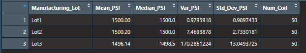

# MechaCar Statistical Analysis

## Summary 
In this unit, we used R Statistics to analyze the miles per gallon of MechaCar units. 

## Overview 
R Statistics were used to perfrom linear regression modelling and t-tests to predict how the dataset performs and if it meets the specific requirements set out for each sample group. The results have been divided into 3 parts, with a potential study recommendation listed as part 4. 

## Results

### Deliverable 1 - Linear Regression to Predict MPG
In the first section of this report, the MechaCar_mpg.csv was used to conduct analysis with the lm() and the summary() function to answer the following questions regarding the miles per gallon statistics:
- Which variables/coefficients provided a non-random amount of variance to the mpg values in the dataset?
- Is the slope of the linear model considered to be zero? Why or why not?
- Does this linear model predict mpg of MechaCar prototypes effectively? Why or why not?

The following results were yielded from the linear regression model: 

The coefficients' p-values are are follows:
- Vehicle Length: 2.60e-12 
- Vehicle Weight: 0.0776 
- Spoiler Angle: 0.3069    
- Ground Clearance: 5.21e-08
- AWD: 0.1852

#### Which variables/coefficients provided a non-random amount of variance to the mpg values in the dataset?
Given the results above, we can assume that the following coefficients are non-random amounts of variance to the miles per gallon values in the dataset: 
- Vehicle Weight: 0.0776 
- Spoiler Angle: 0.3069   
- AWD: 0.1852

#### Is the slope of the linear model considered to be zero? Why or why not?
To consider a relationship between two variables to be statistically significant, and thus the test hypothesis be rejected, the p-value <0.05. In this case, the slope of the linear model is considered not be be zero because p-value (5.08e-08) < 0.05. This means that there is a high likelihood that other variables can contribute to the mpg values in the dataset.

#### Does this linear model predict mpg of MechaCar prototypes effectively? Why or why not?
Given the F-Value results, the r-squared value is 0.71. This means that there is a 71% likelihood of all mpg predictions to be correct. The p-value of the linear regression model comes to be 5.35e-11, which is less than the optimal significance p-level of 0.05. Thus the linear model is not an effective indicator of the mpg of MechaCar prototypes. More variables are required. 

### Deliverable 2 - Summary Statistics on Suspension Coils
The second portion of the analysis, looks at whether the variance of the suspension coils exceeds 100 pounds per square inch. The MechaCar design specifications dictate, that it may not exceed the 100 pounds/squar inch limit. 

#### Does the manufacturing data meet the specifications for all total lots and for each lot individually?

The total summary results indicate that the variance of the PSI sample distributio adn the standard deviation are within the design specifications and do not exceed 100 PSI.

However, looking at the lots individually, it is apparent that Lot 1 and Lot 2 are within the design specifications, however Lot 3 shows the most variance and exceeds the design specifications. 

### Deliverable 3 - T-Tests on Suspension Coils
The t-test of all lots combined is as follows:

With the above t-test result, it is apparent that the p-values for all lots combined is 0.06028, thus p-value=0.06028 > 0.05. This means there is no statistical significance to reject the null hypothesis. 

T-test Lot #1:

T-test Lot #2:

T-test Lot #3:

